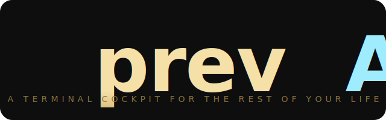

<p align="center">
  
</p>

<p align="center">
  <b>A terminal cockpit for the rest of your life.</b><br/>
  Ask Claude, Codex, Antigravity (Google's `agy`), and your local Ollama the same question in parallel. Let the council vote.
</p>

<p align="center">
  <a href="https://github.com/fru-dev3/prevail-cli/releases"></a>
  <a href="#install"></a>
  <a href="https://bun.sh"></a>
  <a href="https://opentui.com"></a>
  <a href="./LICENSE"></a>
</p>

<p align="center">
  
  <br/>
  <sub><b>The cockpit at a glance.</b> 20+ life domains in the sidebar. The active workspace on the right (here: chief). A single ConfigBar at the bottom carries every per-turn dial — <b>Council</b> · <b>Framework</b> · <b>Lens</b> · <b>Web</b> · <b>Save</b> · <b>Serendipity</b> · <b>Auto</b> — each clickable.</sub>
</p>

---

**One question. Four engines. One verdict.** Every part of your life — wealth, health, tax, career — is a folder of markdown. Open one, ask, and prevAIl fans the question out to every CLI you already have logged in. A chair model reads all four replies and writes one decisive answer, with a dedicated panel surfacing the *disagreement* — which is the point. Works from your terminal or your phone (Telegram bridge). Single 95 MB binary. No daemon, no Docker, no API keys.

<p align="center">
  
  <br/>
  <sub><b>Per-domain workspaces.</b> Each domain has its own <code>chat / state / quick start / prompts / skills</code> tabs. Frameworks (BLUF, SCQA, …) and lenses (FIRST PRINCIPLES, CONTRARIAN, MOM, DAD, …) override per-domain — what you set on <code>wealth</code> stays on <code>wealth</code>.</sub>
</p>

```
┌─ wealth ─────────────────────────────────────────────────────── prevAIl ─┐
│ [chat] · state · quick start · prompts · skills      ● Council ON  ◇ cfg │
├──────────────────────────────────────────────────────────────────────────┤
│ › /council should I prepay the mortgage or invest the cash?              │
│                                                                          │
│   ◆ convening · claude · codex · gemini · ollama                         │
│                                                                          │
│   ◇ Claude    At your tax rate the effective mortgage cost is ~4.1%.    │
│              A diversified index has cleared 7% long-run. Math: invest. │
│   ◇ Codex     Spread = (after-tax return − rate) × principal × years.  │
│              Positive → invest. Keep 6 months liquidity floor.          │
│   ◇ Antigravity Behavioral: a guaranteed return on a known liability vs. │
│              a probabilistic one. Pick the path you'll actually hold.   │
│   ◇ Ollama    Local-only check: same conclusion as the cloud panel.    │
│                                                                          │
│  ┌─ ▸ Where panelists disagreed ──────────────────────────────────┐    │
│  │ Liquidity floor: Codex says 6mo, Antigravity says 12mo (risk-off).  │    │
│  └────────────────────────────────────────────────────────────────┘    │
│                                                                          │
│  ┌─ ◆ Verdict · synthesized by Claude ────────────────────────────┐    │
│  │ Invest IF (a) ≥6mo liquidity, (b) you'll hold through −30%,    │    │
│  │ (c) spread > 2%. Else prepay. Liquidity is the binding test.   │    │
│  └────────────────────────────────────────────────────────────────┘    │
│                                                                          │
│  ready · 4 calls · 3k↑ 1.4k↓ · ~$0.03         ◆ Framework: BLUF  ● ON  │
└──────────────────────────────────────────────────────────────────────────┘
```

## Install

```bash
curl -fsSL https://raw.githubusercontent.com/fru-dev3/prevail-cli/main/scripts/install.sh | bash
prevail
```

First launch runs a 30-second wizard. Pick the bundled demo vault (synthetic, safe to explore) or point at your own folder. macOS + Linux. Windows via WSL.

## Why prevAIl

| | |
|---|---|
| **◆ Council, not a single voice** | Four models in parallel, one chair synthesizes. Disagreement gets its own panel — that's where the value is. |
| **◇ Domain = folder** | `wealth/`, `health/`, `tax/`. Plain markdown. Edit anywhere. Sync with git, iCloud, Tailscale. No database. |
| **● Uses CLIs you already pay for** | Spawns `claude`, `codex`, `gemini` — inherits every login, MCP server, and skill. No API keys to manage. |
| **◇ Local-private when it matters** | Ollama auto-detected at `localhost:11434`. Run health or wealth on a local-only council. |
| **▸ Off-the-keyboard** | `prevail daemon --telegram` exposes the cockpit on your phone. Same engines, same council. Chat-ID allowlist enforced. |
| **◆ Scheduled briefings** | `prevail briefing add --cron "0 7 * * *" --domain wealth --prompt "what's new this week?"`. Verdict lands on your phone at 7am. |
| **◇ Self-curating vault** | Every chat writes a one-line summary to `<domain>/_log/YYYY-MM-DD.md`. The vault writes its own decision log. |
| **● Hardened by default** | Vault-shell off by default, env-scrubbed subprocess, file-locked schedules, OAuth refresh tokens chmod 0600. [Audit notes →](./CHANGELOG.md#security--adversarial-sweep) |

## The cockpit at a glance

```
┌─ prevAIl ─────────────────────────────────────────────────────────────────┐
│  domains            │  [chat] · state · quick start · prompts · skills    │
│  ───────────────    │  ───────────────────────────────────────────────    │
│  ▸ wealth      ●    │                                                     │
│    health      ·    │   council  ● ON       framework  ◆ BLUF             │
│    tax         ·    │   vault    ▸ open     ◇ configure                   │
│    career      ·    │                                                     │
│    chief       ·    │  ─ chat ──────────────────────────────────────────  │
│    vision      ·    │   you › what's new in tax this quarter?             │
│                     │   ai  › Three deltas worth pulling forward …       │
│  apps  [s]          │                                                     │
│  ───────────────    │   ▸ tools     ◆ Council ON     ◇ configure         │
│    1password   ✓    │                                                     │
│    plaid       ✓    │                                                     │
│    youtube     !    │  claude ✓   codex ✓   gemini ·   ollama ✓          │
└─────────────────────┴─────────────────────────────────────────────────────┘
```

- **Sidebar** lists every domain and every connected app. `↑ ↓` to navigate, `s` to swap focus between the two lists.
- **Tab strip** is consistent everywhere: `chat` is the default landing, `state` shows the live vault snapshot, `quick start` / `prompts` are editable markdown, `skills` toggles which skills the chair can call.
- **Council** is a single toggle on the right. `● ON` fans every question to every available CLI; `◆ OFF` uses just the active one.
- **Framework** cycles through BLUF · WIN · SCQA · SBAR · OODA · pros/cons · steelman. One click; the answer is rewritten in that structure.
- **Tools panel** (`▸ tools`) exposes the MCP server snippet, Telegram setup, briefings, calibration, benchmarks, and clickable paths to the vault + config.

## 30 seconds in

```bash
# Boot the cockpit
prevail demo                    # safe synthetic vault — explore first
prevail                         # use your own vault

# Inside, type:
/council should I sell or rent? # fans to all engines, gives one verdict
/framework bluf                 # Bottom Line Up Front structure
/distill                        # turn this conversation into a reusable skill
```

## On your phone

```bash
prevail telegram setup <bot-token>     # token from @BotFather
prevail telegram add-user <chat-id>    # mandatory allowlist
prevail daemon --telegram              # poll Telegram + tick briefings
```

Now `/council`, `/domain wealth`, `/framework bluf` — from anywhere.

## Connectors

Every app declares how it authenticates: `api`, `oauth`, `browser`, `mcp`, or `manual`. Click a connector in the sidebar to see live auth status, what's missing, and **Test Connection**. The OAuth runner handles PKCE + loopback callback + token refresh:

```bash
prevail connectors list
prevail connectors test plaid
prevail connectors oauth youtube-analytics
```

Ships with examples for each auth type: Plaid (api), LinkedIn (browser), YouTube Analytics (oauth), GitHub (http+key), Google Calendar (mcp).

## Commands

```
prevail                          boot the cockpit
prevail init                     first-run wizard
prevail demo                     use the synthetic vault
prevail doctor                   check vault + CLIs
prevail council ...              council ops from the shell
prevail briefing ...             scheduled domain briefings
prevail telegram ...             configure the Telegram bridge
prevail connectors ...           list / test / oauth
prevail daemon --telegram        headless mode (bot + ticker)
```

Inside the TUI: `↑ ↓` between domains, `s` swap to apps, `e` edit the active markdown tab, `q` quit. `/help` lists every slash command.

## Platform

prevAIl is bun-only. Currently builds for:

- macOS arm64 (Apple Silicon)
- macOS x86_64 (Intel)
- Linux arm64
- Linux x86_64
- Windows via WSL only (no native Windows build — bun's Windows support is preview-quality as of bun 1.3.x; we'll add Windows binaries when bun's Windows story stabilizes)

A terminal with UTF-8 + true-color is required. Tested on iTerm2, kitty, alacritty, WezTerm, Ghostty, GNOME Terminal. Should work in most modern xterm-256color terminals.

## Requirements

- One or more of: [Claude Code](https://claude.com/code) · [Codex](https://github.com/openai/codex) · [Antigravity CLI / `agy`](https://github.com/google/antigravity-cli) · [Ollama](https://ollama.com)
- Terminal with UTF-8 + true color
- macOS / Linux (Windows via WSL — see [Platform](#platform))

## Built with

[OpenTUI](https://opentui.com) (Zig core + React reconciler) on [Bun](https://bun.sh). Single binary via `bun --compile`. No runtime dependencies.

## Docs · changelog · roadmap

- [**CHANGELOG**](./CHANGELOG.md) — what shipped in each tag
- [**Releases**](https://github.com/fru-dev3/prevail-cli/releases) — pre-built binaries
- [**Demo vault**](./vault-demo) — synthetic "Alex Rivera" persona
- [**Connector architecture**](./docs/connector-architecture.md) — auth probes, OAuth runner, manual recipes
- [**Threat model**](./docs/threat-model.md) — long-form threat model + worked example
- [**Data flow**](./docs/data-flow.md) — how a turn moves through cockpit / vault / log / journal / benchmark
- [**Extending**](./docs/extending.md) — how to add a framework, lens, CLI bridge, ConfigBar chip, slash command

## Scope

prevAIl is a **single-user terminal cockpit** for personal decisions. You run it on your own machine, with your own AI CLI credentials, against a folder of your own markdown.

It is **not** a SaaS, **not** multi-tenant, **not** an enterprise audit-log system, **not** a replacement for a knowledge base. If you need any of those, prevAIl is the wrong tool.

> **Vault sync caveat.** If you sync your vault folder via iCloud, Dropbox, Tailscale Drive, git, or any other mechanism, sync should cover `<vault>/` only and **MUST EXCLUDE `~/.prevail/`**. The latter contains secrets (Telegram bot tokens, OAuth refresh tokens) and machine-local state.

The threat model is documented in [SECURITY.md](./SECURITY.md) and [docs/threat-model.md](./docs/threat-model.md). Read those before exposing the MCP server or the Telegram bridge to anything other than your own laptop.

## License

MIT. The bundled demo vault contains no real personal data.
